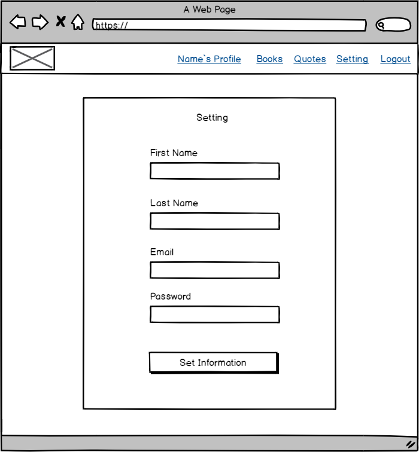

# Book Recommendation
## Technologies used:
- html
- CSS
- javascript
- npm Packages
- Node js
- Express Router
- Mongoose 
- Express Authentication

## Wireframes:

## Development process and problem-solving strategy:
Firstly, We designed wireframes by using balsamiq. After that we used mongoose database to save and manage data. Also, we used express router to orgnize code, ejs to structure our website,  express authentication bacause it support authentication using a username and password. Finally, we used CSS to control presentation, colors and background.

